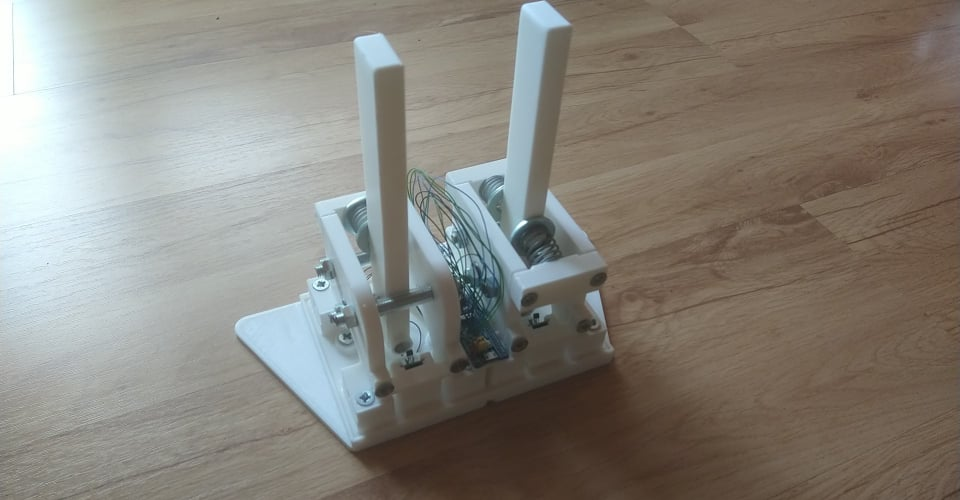
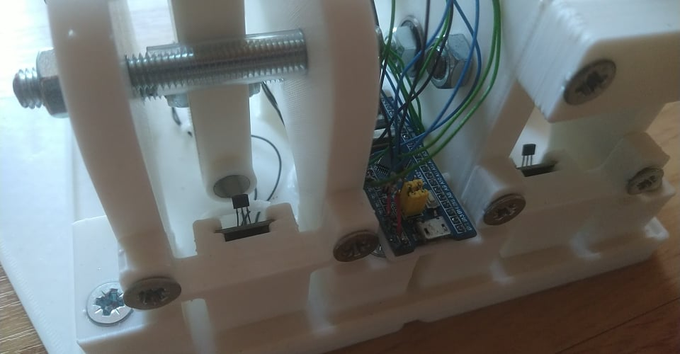

Author: Grzegorz Heller  
Project created on: 02.2021  

# Blue_Pill_USB_HID_Example

 This is an example of using USB HID communication on Blue Pill with STM32CubeIDE. This is the project I used to create an analog handbrake and sequential shifter for PC racing games. I designed the mechanical parts in Fusion 360 and 3D printed them. Then I assembled the device using the printed parts, screws and springs. In terms of code the hardest part was understanding descriptors and designing a custom descriptor. For this I used the official tool from usb.org. You can use this project to analyse my descriptor and how I combined USB communication with ADC to make the shifter and handbrake work. The descriptor is located in USB_DEVICE/App/usbd_custom_hid_if.c. The ADC and transmission code is located in Core/Src/main.c. I used DMA. Other than the MCU, I used three Hall sensors - two for the brake and one for the shifter. The shafts have little magnets attached to them, and based on the shaft's position the Hall sensors are outputting a certain voltage. This results in a nonlinear output, however due to the power of the magnets (neodymium) and relatively small distance travelled, this is absolutely not an issue. The end result is presented with the pictures below. This device was my first prototype, so there could still be a lot to improve, especially in the 3D design to make it look more appealing and easier to assemble for example. The device was tested in games and worked as intended. 

  

  

